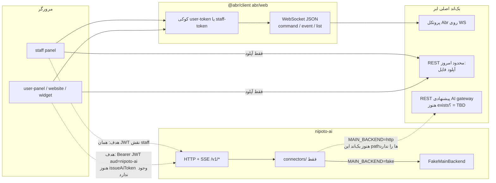

# اتصال `nipoto-ai` به پروژهٔ `abr/web` (`@abr/client`)

> **منبع اتصال Abr این فایل نیست.** دستور پخت اتصال برای پیاده‌سازی بعدی: [ABR-CONNECTION.fa.md](./ABR-CONNECTION.fa.md).
> جملهٔ زیر («nipoto-ai نباید سوکت Abr را پیاده کند») برای intent فعلی اشکان منسوخ است؛ آن سند را بخوانید.
> بقیهٔ این فایل (طراحی محصول / REST) را برای نوشتن connector Abr دنبال نکنید.

> مخاطب: یک agent کدنویس که باید سرویس AI را به اکوسیستم نیپوتو وصل کند.
> تاریخ برداشت از کد: ۱۴۰۵/۰۶/۲۱ (2026-09-12).
> منبع حقیقت این سند: کد واقعی در `abr/web` و مصرف‌کننده‌هایش، به‌علاوهٔ کد فعلی `nipoto-ai`.
> اگر با [AI-SERVICE.fa.md](./AI-SERVICE.fa.md) یا [contracts/main-backend.openapi.yaml](./contracts/main-backend.openapi.yaml) تعارض دیدید، **کد** بر سند طراحی مقدم است؛ تعارض را صریح بنویسید، حدس نزنید.

**یک جملهٔ حیاتی:** مسیر `/home/ashkan/Projects/nipoto/abr/web` یک اپ وب (Next.js / Vue / SPA) نیست. پکیج `@abr/client` است: SDK مرورگر/Node برای پروتکل CQRS روی WebSocket به بک‌اند اصلی ابر. `nipoto-ai` **نباید** این پروتکل سوکت را پیاده‌سازی کند و **نباید** `@abr/client` را import کند.

---

## ۰. چطور این سند را بخوانید

| اگر می‌خواهید… | بروید به |
|---|---|
| بفهمید این ریپو اصلاً چیست | §۱ |
| بفهمید AI از کجا به کجا وصل می‌شود | §۲ و §۱۰ |
| توکن، کوکی، CSRF، CORS | §۴ |
| شکل واقعی پیام سوکت | §۵ |
| دامنهٔ پشتیبانی (چت / FAQ / پیام) | §۶ |
| REST واقعی که امروز وجود دارد | §۷ |
| قراردادی که `nipoto-ai` **انتظار** دارد (هنوز TBD) | §۸ |
| الگوهای فرانت برای کپی | §۹ |
| env و اجرای محلی | §۳ |
| واژه‌نامه | §۱۱ |
| اشتباه‌های رایج | §۱۲ |
| فرض‌ها و سؤال‌های باز | §۱۳ |

شناسه‌ها، env، path، type و URL را به انگلیسی همان‌طور که در کد آمده نگه دارید.

---

## ۱. مدل ذهنی: این پروژه چیست (و چه نیست)

### ۱.۱ واقعیت

| | مقدار |
|---|---|
| مسیر | `/home/ashkan/Projects/nipoto/abr/web` |
| نام npm | `@abr/client` (`package.json` → `"name": "@abr/client"`, نسخهٔ `0.0.4`) |
| نقش | کلاینت JS برای فریم‌ورک CQRS «ابر»: command / event / list روی یک WebSocket |
| entry | `index.js` → `src/index.js`؛ export پیش‌فرض `abr`، named export `Auth` |
| دامنهٔ محصول | **هیچ.** Context/Aggregate/command در این ریپو hard-code نشده. پروکسی پویا است؛ سرور بعد از handshake یک `config` می‌فرستد و بقیهٔ نام‌ها را فرانت حدس می‌زند / از بک‌اند می‌داند |
| README | تقریباً خالی (`# Abr SDK`). راهنما در `doc/fa/` |
| `.env.example` / `AGENTS.md` | وجود ندارد |
| OpenAPI / zod / tRPC / GraphQL | وجود ندارد |
| i18n / RTL | وجود ندارد (کلاینت زبان‌آگاه نیست؛ UI فارسی در فرانت است) |

اپ‌های واقعی نیپوتو کنار این SDK هستند، نه داخلش:

| مسیر | نقش | نسخهٔ `@abr/client` دیده‌شده |
|---|---|---|
| `/home/ashkan/Projects/nipoto/front-end/user-panel` | پنل کاربر (Quasar/Vue) | `^0.0.4` |
| `/home/ashkan/Projects/nipoto/front-end/staff` | پنل کارشناس | `0.0.3` |
| `/home/ashkan/Projects/nipoto/front-end/website` | سایت (Nuxt) | `^0.0.3` |
| `/home/ashkan/Projects/nipoto/front-end/market` | بازار | — |
| `/home/ashkan/Projects/nipoto/front-end/new-support` | ویجت/کنسول پشتیبانی جدید (`SupportGateway`) | `0.0.3` |
| `/home/ashkan/Projects/nipoto/app/web-app` | اپ وب دیگر | `^0.0.3` |

`nipoto-ai` یک سرویس Python/FastAPI جدا است (`/home/ashkan/Projects/nipoto/service/nipoto-ai`). اصل AI-1: از کد و دیتابیس بک‌اند اصلی چیزی import نمی‌کند. اصل AI-2: مکالمه، پیام، کاربر، سفارش و `handledBy` فقط در بک‌اند اصلی‌اند.

### ۱.۲ چرخهٔ حیات اتصال `@abr/client`

از `src/index.js`:

1. `abr(url, protocol, options)` → `socket.setConfig` + `socket.connect()`.
2. سرور پیام `type: "config"` می‌فرستد → bus رویداد `configReceived`.
3. `generateDomains({ config, socket, bus, auth })` یک Proxy برمی‌گرداند؛ این همان `$app` فرانت است.
4. `sendToken(config.wss)` اگر کوکی توکن باشد، command داخلی `Abr.Socket` / `sendToken-<wss>` را می‌فرستد.
5. اگر توکن معتبر باشد `auth.tokenVerified = true` و listenerهای event دوباره enable می‌شوند.

بدون پیام `config` از سرور، Promiseِ `Abr(url)` resolve نمی‌شود.

### ۱.۳ آنچه این SDK **نیست**

- BFF یا API route برای `nipoto-ai`
- منبع حقیقت مکالمه / سفارش / کاربر
- کلاینت REST برای gateway پیشنهادی §۸
- جایی برای گذاشتن کلید LLM یا `MAIN_BACKEND_TOKEN`

---

## ۲. معماری اتصال (وضعیت واقعی + هدف)



خطوط نقطه‌چین **پیاده‌سازی‌نشده**اند. خطوط توپر در کد امروز کار می‌کنند.

**قانون اتصال برای agent:**

| جهت | مجاز؟ | روش |
|---|---|---|
| فرانت → بک‌اند اصلی | بله (موجود) | `@abr/client` روی `ws`/`wss` |
| فرانت → `nipoto-ai` | هدف فاز ۳/۵ | `Authorization: Bearer <jwt>`، SSE؛ **بدون کوکی** |
| `nipoto-ai` → بک‌اند اصلی | هدف فاز ۳+ | فقط REST در `app/connectors/http.py` |
| `nipoto-ai` → سوکت Abr | **نه** | اصل AI-1؛ کلاینت پایتونی سوکت وجود ندارد |
| `nipoto-ai` → دیتابیس بک‌اند | **نه** | اصل AI-1 |
| خواندن کوکی `user-token` / `staff-token` داخل `nipoto-ai` | **نه** | §۴ و §۶.۲ سند طراحی |

---

## ۳. چطور `@abr/client` و فرانت را محلی اجرا کنید

### ۳.۱ خود SDK

ریپو اسکریپت `start`/`dev` ندارد. تست:

```bash
cd /home/ashkan/Projects/nipoto/abr/web
npm test          # mocha، تنظیم در .mocharc.json → tests/*.test.js
```

وابستگی‌ها: `isomorphic-ws`, `js-cookie`, `uuid`, `@noble/curves`, `@noble/hashes`.
انتشار: GitLab npm خصوصی `https://git.services.iranpage.net/api/v4/projects/113/packages/npm/` (`.gitlab-ci.yml` فقط روی `main` publish می‌کند).

لینک محلی (از `doc/fa/index.md`):

```bash
cd /home/ashkan/Projects/nipoto/abr/web && npm link
cd /path/to/front-end && npm link @abr/client
```

### ۳.۲ فرانت‌ها (مصرف‌کنندهٔ واقعی)

اتصال با `Abr(url)` که `url` از hostname ساخته می‌شود، نه از یک `.env` ثابت در production.

منبع: `front-end/user-panel/src/utils/resolveBackHost.js` و معادل support در `front-end/new-support/packages/support-sdk/src/env/resolveBackend.ts`.

| وضعیت host | WebSocket | REST |
|---|---|---|
| `localhost` / IP | `ABR_URL` اجباری است (user-panel خطا می‌دهد اگر خالی باشد). support-sdk پیش‌فرض `b1-back.nipoto.pro` | همان host با `http`/`https` |
| deployشده | sibling `back`: مثلاً `app.nipoto.com` → `wss://back.nipoto.com` | `https://back.nipoto.com` |
| flavor عددی | `b5-app.nipoto.pro` → `b5-back.nipoto.pro` | همان |
| stage نام‌دار | `app-stage2.nipoto.pro` → `back-stage2.nipoto.pro` | همان |
| موبایل | `m.nipoto.org` → `b.nipoto.org` | همان |
| مسیر تلگرام/بله | `telegram.` / `bale.` sibling یا `TELEGRAM_URL` / `BALE_URL` | جدا از پشتیبانی AI |

Allowlist سخت‌گیرانه در support-sdk (`ALLOWED_BASE_DOMAINS` = `nipoto.com`, `nipoto.pro`, `nipoto.org`؛ hostهای دقیق مثل `back.nipoto.com`, `b1-back.nipoto.pro`). URL دلخواه بک‌اند در build دیپلوی رد می‌شود.

Boot نمونه (user-panel): `src/boot/abr.js` تا ۱۵ ثانیه منتظر `Abr(url)` می‌ماند؛ بعد `app.$app = store.$app = abr`. timeout → مسیر `Error500`.

### ۳.۳ envهایی که برای یک سرویس متصل مهم‌اند

**در `@abr/client` هیچ envای نیست.**

**در فرانت (localhost):**

| کلید | کجا | معنی |
|---|---|---|
| `ABR_URL` | user-panel / staff / website / support-sdk | host بک‌اند (با یا بدون `ws://`) |
| `ABR_WS_URL` | فقط support-sdk | اگر ست شود باید همان hostِ `ABR_URL` باشد |
| `VUE_APP_ROOT_DOMAIN` | `authCookie.js` | دامنهٔ کوکی؛ اگر با hostname فعلی نخواند، `domain` ست نمی‌شود |
| `TELEGRAM_URL` / `BALE_URL` | `resolveBackHost.js` | کانال‌های جدا؛ خارج از محدودهٔ MVPِ AI |

**در `nipoto-ai` (`.env.example`):**

| کلید | پیش‌فرض | نقش برای اتصال |
|---|---|---|
| `MAIN_BACKEND` | `fake` | تا REST واقعی نباشد روی `fake` بمانید |
| `MAIN_BACKEND_URL` | خالی | base URL قرارداد §۸؛ وقتی بک‌اند gateway را ساخت |
| `MAIN_BACKEND_TOKEN` | خالی | credential سرویس AI؛ فقط روی endpointهای قرارداد |
| `FAKE_BACKEND_DIR` | `data/fixtures/conversations` | فیکسچر مکالمه |
| `JWT_AUDIENCE` | `nipoto-ai` | `aud` توکن ورودی به AI |
| `JWT_PUBLIC_KEY_FILE` | `.keys/dev_public.pem` | تأیید JWT در dev |
| `JWKS_URL` | خالی | هدف production: JWKS بک‌اند (B-AI-1) |
| `CORS_ORIGINS` | `http://localhost:8080,http://localhost:5173` | هرگز `*`؛ `allow_credentials=False` |
| `DEMO_ENABLED` | `true` | صفحهٔ `/demo` فقط dev |

اجرای AI محلی: `make install && make keys && make up && make migrate && make run` → `:8080`. توکن dev: `make token ROLE=staff SUB=u1`.

---

## ۴. احراز هویت و هویت

### ۴.۱ مدل واقعی فرانت (کوکی + سوکت)

پیاده‌سازی: `abr/web/src/auth.js` + override در هر میزبان.

| مورد | کد واقعی |
|---|---|
| نام پیش‌فرض کوکی در SDK | `token` (`auth.cookieName`) |
| نام واقعی در نیپوتو | کاربر/ویجت: `user-token`؛ کارشناس: `staff-token` |
| ست شدن | پیام سرور `type: "set-token"` → `Cookie.set(cookieName, data.data.token, cookieAttributes)` |
| پاک شدن | `type: "remove-token"` یا رد شدن `sendToken` |
| attribute پیش‌فرض SDK | `secure: true` مگر `metadata.dev`؛ `sameSite: 'secure'` (**مقدار نامعتبر برای Cookie**؛ فرانت‌ها به `Lax` عوض می‌کنند) |
| انقضا | `metadata.expires` به‌صورت Unix seconds → `Date` |
| دامنه | localhost/IP: host-only. production: `.{root}` مثلاً `.nipoto.com` از `getAuthCookieDomainAttribute()` |
| ارسال مجدد بعد از connect | `Socket.sendToken`: `data: { token: auth.getToken().split(' ')[1] }` |

**فرمت کوکی:** مقدار اغلب شبیه `Bearer <jwt>` است (تست support: `user-token=Bearer%20abc`). `sendToken` فقط قطعهٔ بعد از فاصله را به سرور می‌دهد. آپلود REST همان **مقدار خام کوکی** را در هدر `authorization` می‌گذارد (نه لزوماً با پیشوند دوباره).

تشخیص سمت: hostname شامل `staff` → `staff-token`؛ وگرنه `user-token` (`inferSideFromHostname`).

رویدادهای bus مرتبط:

| رویداد | معنی |
|---|---|
| `tokenSet` | سرور توکن نوشت؛ `doc/fa/abr.md` پیشنهاد می‌کند بعد از آن list کاربر گرفته شود |
| `tokenRemoved` | توکن نامعتبر/حذف؛ فرانت logout / redirect |
| `tokenVerified` | `sendToken` موفق؛ payload شیء user |
| `userSet` / `userRemoved` | هویت روی سوکت |
| `rolesSet` / `roleAdded` / `roleRemoved` | نقش |
| `permissionsSet` / `permissionAdded` / `permissionRemoved` | مجوز |
| `socketConnected` / `socketDisconnected` / `socketReconnecting` / `socketReconnected` / `socketReconnectingIn` | عمر سوکت |

CSRF برای سوکت مطرح نیست (origin در handshake؛ توکن در کوکی اما ارسال صریح با command). برای REST آپلود هم CSRF جدا دیده نشد؛ اعتماد روی همان هدر `authorization` است.

`httpOnly` امروز **نیست**. سند طراحی AI (§۶.۲) می‌گوید برنامه این است که بشود؛ بعد از آن فرانت نمی‌تواند توکن را بخواند و به `nipoto-ai` بدهد. برای همین AI به JWT کوتاه‌عمر جدا نیاز دارد.

### ۴.۲ مدل `nipoto-ai` (Bearer اختصاصی)

پیاده‌سازی: `app/core/auth.py`.

```
Authorization: Bearer <jwt>
الگوریتم: RS256
الزامی: exp, sub, aud
aud باید برابر JWT_AUDIENCE (nipoto-ai) باشد
role باید یکی از: staff | user | guest | service | admin
```

هویت فقط از JWT ساخته می‌شود (`Actor.user_id = sub`). هرگز از body. کوکی خوانده نمی‌شود. CORS بدون credentials.

صدور توکن (`POST /auth/ai-token`) و JWKS **در بک‌اند اصلی وجود ندارند** (`exists? = TBD` در قرارداد). راه فعلی dev: `make keys` + `make token`.

ماتریس نقش (هدف، از سند طراحی؛ endpointهای drafts/replies هنوز در `app/api/` پیاده نشده‌اند؛ امروز فقط `/v1/health` و `/v1/ready`):

| نقش | drafts | replies | search | feedback | admin/* |
|---|---|---|---|---|---|
| `staff` | مکالمه‌های مجاز بک‌اند | خیر | بله | بله | خیر |
| `user` | خیر | فقط مکالمهٔ خودش | خیر | بعداً | خیر |
| `guest` | خیر | مکالمهٔ خودش؛ دانش public | خیر | خیر | خیر |
| `service` | بله | بله | بله | بله | خیر |
| `admin` | خیر | خیر | بله | خیر | بله |

### ۴.۳ آنچه سرویس **نباید** بکند

- کوکی `user-token` / `staff-token` را به‌عنوان توکن AI بپذیرد (مگر راه موقت `whoami` که سند صریحاً ضعیف می‌داند و بعد از `httpOnly` می‌شکند).
- `userId` را از query/body برای سفارش یا مکالمه بپذیرد.
- origin را `*` کند.
- توکن اصلی کاربر را در لاگ بنویسد.

---

## ۵. سطح پروتکل Abr (سوکت) — فقط برای فهم بک‌اند

`nipoto-ai` این فریم‌ها را نمی‌فرستد. اگر agent وسوسه شد «همان command را با ws بزن»، توقف کنید.

### ۵.۱ فریم خروجی (`Socket.send` در `src/socket/Socket.js`)

```json
{
  "type": "command | event | list",
  "namespace": "Context.Aggregate",
  "aggregate": { "id": "<uuid>", "exists": true },
  "name": "commandOrListOrEventName",
  "id": "<uuid پیام>",
  "data": {},
  "options": { "delivered": true, "rejected": true },
  "metadata": { "date": "<ISO Date>" }
}
```

- `namespace` با `.` به رشته تبدیل می‌شود (`generateNamespace.js`؛ FIXME در کد: جداکننده از config سرور خوانده نمی‌شود).
- command بدون id: `aggregate.id` یک UUID تازه است و `exists` ندارد.
- list: `data.methods` آرایهٔ `{ name, args }` است؛ `options.live` برای اشتراک زنده.
- timeout command/list: ۴۰ ثانیه (`src/domains/config.js`). list روی `REQUEST_TIMEOUT_EXCEEDED` تا ۳ بار retry می‌کند.

تشخیص aggregate در برابر command: اگر آرگومان اول **رشتهٔ UUID** باشد، aggregate id است. اگر `string` غیر UUID بدهید، SDK آن را dataِ command می‌گیرد — و `doc/fa/command.md` می‌گوید این کار معمولاً `no authorization` می‌دهد. **هرگز data را string نفرستید.**

### ۵.۲ فریم ورودی (`dispatchSocketMessage` در `src/socket/receive.js`)

| `message.type` | رفتار |
|---|---|
| `ping` | `bus.publish('ping', data)` — doc می‌گوید هر ۳ ثانیه، data = delay ms |
| `delivered` | `bus.send('delivered.' + data.id)` |
| `command-rejected` / `event-rejected` / `list-rejected` / `message-rejected` | `bus.send('rejected.' + metadata.message.id, data)` |
| `command` / `command-event` / `event` / `list` | routing با `name` + id پیام |
| `event-canceled` | لغو listener |
| `set-token` / `remove-token` | کوکی |
| `set-user` / `remove-user` / نقش و permission | bus |
| `config` | `configReceived` |
| `dev` | `console.log` + publish |
| سایر | `bus.publish(type, data)` |

کدهای خطای سطح فریم‌ورک از `doc/fa/index.md` (سرور؛ در این ریپو enum ثابت نیست):

- endpoint اشتباه یا بدون مجوز → `FORBIDDEN`
- نیاز به لاگین / توکن منقضی → `UNAUTHORIZED`
- خطای منطقی command → reject با `data` دلخواه سرور
- کلاینت: `REQUEST_TIMEOUT_EXCEEDED` (`src/domains/exception.js`)

Pagination/rate-limit استاندارد HTTP در سوکت نیست. سقف `limit` را سرور روی هر متد list می‌گذارد (doc می‌گوید پیش‌فرض `limit` بین ۱ تا ۱۰؛ در عمل فرانت `limit(100)` و `take(10)` می‌زند — رفتار واقعی سرور از این ریپو قابل اثبات نیست).

### ۵.۳ رمزنگاری اختیاری payload

اگر سرور `type: "ws-crypto-server-hello"` با `data.serverPublicKey` (X25519، ۳۲ بایت، base64) بفرستد:

1. کلاینت keypair می‌سازد، `ws-crypto-client-hello` با `clientPublicKey` می‌فرستد.
2. AES-GCM از HKDF-SHA256 با info `abr-ws-crypto-v1`.
3. همهٔ فریم‌های بعدی: رشتهٔ `ENC1:` + base64(iv12 + ciphertext).
4. بعد از enable، فریم plaintext (جز hello) drop می‌شود.

جزئیات: `src/socket/wsPayloadCrypto.js`, `wsCryptoClient.js`, `doc/framework/encryption-scenario.md`.

Reconnect: تأخیر `[1, 1, 2, 5, 10, 20, 40, 60]` ثانیه. event listenerها بعد از `sendToken` دوباره `Event.enable()` می‌شوند.

### ۵.۴ API سطح JS برای فرانت (نه برای AI)

```js
import Abr, { Auth } from '@abr/client'
Auth.cookieName = 'user-token' // یا staff-token
const app = await Abr('wss://back.example')

// command
await app.User.Auth.login(data).await('loggedIn').send()
await app.Support.Chat(chatId).sendMessage({ text }).await('messageSent').send()

// list
await app.Support.Chat.lists.chat.where('status', 'in', ['opened']).limit(10).get().send()

// event
const h = await app.Support.Chat.on('availed', fn, { minimal: true })
h.cancel()

// داخلی
app.$abr.bus
app.$abr.socket
app.$abr.auth
app.$abr.config
```

`$abr` همان شیء `{ config, socket, bus, auth }` است که در `src/index.js` به `generateDomains` داده می‌شود.

---

## ۶. دامنهٔ پشتیبانی — سطح واقعی محصول روی Abr

منبع: `front-end/new-support/packages/support-sdk/src/gateway/SupportGateway.ts` و `docs/BACKEND_REQUIREMENTS.md` / `PRODUCT_MAP.md`.

**موجودیت Ticket جدا نیست.** Chat و Ticket دو سطح UI روی `$app.Support.Chat` هستند.

### ۶.۱ Aggregateها

| Namespace | کار |
|---|---|
| `Support.Chat` | باز/بستن/صف، پیام، convey، availability |
| `Support.Message` | تاریخچه و seen |
| `Support.Department` | دپارتمان FAQ/چت |
| `Support.FAQ` | دانش مشتری (مرجع دانش فعلی) |
| `Support.Predetermined` | پاسخ آمادهٔ کارشناس |
| `User.Staff` | پروفایل کارشناس |
| `User.Auth` / `User.User` | لاگین کاربر |
| `Mastering.File` | فایل/thumbnail بعد از آپلود REST |
| `Market.Order` / `Market.Spot.Order` | سفارش معامله (نه سفارش فروشگاهی AI) |

### ۶.۲ Command → event (await)

| فراخوانی | await |
|---|---|
| `Support.Chat.open({ department, title })` | `opened`, `queued` |
| `Support.Chat(id).reOpen()` | `opened`, `queued` |
| `Support.Chat(id).close()` | `closed` |
| `Support.Chat(id).sendMessage({ text })` | `messageSent` |
| `Support.Chat(id).sendFile(data)` | `messageSent` |
| `Support.Chat(id).processing()` | `processing` |
| `Support.Chat(id).convey(data)` | `conveyed` |
| `Support.Chat.avail()` | `availed` |
| `Support.Chat.unAvail()` / `unAvail({ userID })` | `unAvailed` |
| `Support.Message.seen({ chatID, messagesID })` | (بدون await اجباری) |
| `User.Auth.login` | `loggedIn` (+ `tempLoggedIn`, `loggedInWithEmergencyPassword`, `tempRegistered`) |
| `User.Auth.logout` | `loggedOut` |
| `User.User.register` | `registered` |
| CRUD Department/FAQ/Predetermined | `added` / `updated` / `deleted` |

### ۶.۳ Listهای پرکاربرد Chat / Message

| متد روی `Support.Chat.lists.chat` | کاربرد |
|---|---|
| `get()` / `where` / `sort` / `limit` / `skip` / `count` | لیست تیکت |
| `getChat(id)` | یک مکالمه |
| `getOpenChats({ startRow, rowsPerPage }, filter)` | بازها؛ `filter` مثلاً `'self'` |
| `getActiveChats({ startRow, rowsPerPage })` | فعال (سمت کاربر) |
| `getClosedChats(...)` / `getQueuedChats(...)` | بسته / صف |
| `countOpenChats(filter)` | شمارش |
| `getUserData({ chat, userID })` | دادهٔ کاربر یک چت |

`Support.Message.lists.message.getChatMessages(payload)` — شکل دقیق `payload` در این ریپوها typed نیست؛ فرانت همان object را عبور می‌دهد.

فیلتر لیست (camelCase، از `applyConversationQuery`): `title` LIKE، `status` (مقدار `'opened'` یعنی `in ['opened','reopened']`)، `staff`, `department`, `updatedAt` با `>=` / `<=`.

Authorization لیست: غیرمدیر در UI خودش `filter.staff` می‌گذارد. اینکه سرور enforce می‌کند **از فرانت قطعی نیست** (B4 در BACKEND_REQUIREMENTS؛ وضعیت: در انتظار بک‌اند). `nipoto-ai` هرگز به این فیلتر اعتماد نکند؛ مالکیت را از REST خودش بپرسد.

### ۶.۴ شکل دادهٔ Chat / Message در فرانت (پایدار نیست)

نرمال‌سازی دفاعی است چون بک‌اند فیلدها را یکدست نکرده (`conversation.ts`, `message.ts`):

**Conversation** (بعد از `toConversation`):

```
id, chatID?, title?, status?, departmentId?, departmentName?,
staffId?, staffName?, userId?, userName?,
createdAt?, updatedAt?, queuedAt?, openedAt?, closedAt?
```

`status`هایی که UI می‌شناسد: `queued | processing | opened | reopened | staff-replied | user-replied | conveyed | requeued | closed`.

**این فیلدها در مدل فرانت نیستند:** `handledBy`, `authorKind`. قرارداد AI آن‌ها را **جدید** می‌داند (`contracts/main-backend.openapi.yaml` خط ۲۰).

**Message** (بعد از `toChatMessage`):

```
id, conversationId?, from?, text, html?, type?, sentAt?, seen, hasAttachment, attachmentId?
```

- متن ممکن است HTML باشد؛ UI sanitize می‌کند.
- `type === 'chatSystemMessage'` → `'system'`.
- فرستنده `from` است نه `authorKind`.
- لیست خام ممکن است آرایه یا `{ data | items | rows | result }` باشد.

**FAQ** (`FaqItem` در `catalog.ts`):

```
id, question, excerpt, answer, departmentId?, tags[]
```

کلیدهای ورودی محتمل: `question|title`, `answer|body|content`, `department|departmentId`, `_id|id`.

تبدیل به قالب ingest AI: `scripts/convert_kb.py` → `{ id, type: "faq", visibility, title, body, url, updated_at }`.

### ۶.۵ سفارش معامله ≠ سفارش پشتیبانی

`$app.Market.Spot.Order.lists.order` سفارش خرید/فروش ارز است. B-AI-8 (`GET /me/orders`) باید خلاصهٔ **سفارش محصول/ارسال** با فیلدهای allowlist باشد، نه این لیست. اگر بک‌اند موجودیت جدا ندارد، این یک سؤال باز است (§۱۳).

---

## ۷. REST واقعی بک‌اند (امروز)

غیر از سوکت، فرانت این HTTPها را صدا می‌زند. **هیچ‌کدام gateway AI نیستند.**

| روش و مسیر | کجا | هدر | body |
|---|---|---|---|
| `POST {back}/file/upload/support` | پیوست چت | `authorization: <مقدار خام کوکی>` ، `content-type: application/json` | JSON؛ فایل **base64** در فیلد `file` |
| `POST {back}/support/upload` | آواتار | همان | JSON + `field: 'avatar'` |

منبع: `front-end/new-support/packages/support-sdk/src/gateway/upload.ts`.

خطاهای دیده‌شده در body: `WRONG_FILE_TYPE`, `MAXIMUM_FILE_SIZE_LIMIT`. سقف UI حدود ۶MB؛ MIME عملی `jpg,jpeg,png`.

سایر `axios` + `Cookies.get('user-token')` در user-panel (اعلان، اسلایدر، …) RESTهای جانبی پنل‌اند، نه قرارداد مکالمه.

OpenAPI عمومی برای بک‌اند اصلی در این workspace دیده نشد.

---

## ۸. قرارداد REST که `nipoto-ai` از قبل نوشته — هنوز «موجود است؟ = TBD»

فایل: `contracts/main-backend.openapi.yaml`  
کلاینت: `app/connectors/http.py` + نگاشت `app/connectors/mapping.py`  
تست قرارداد: `tests/test_connector_http.py` ، `make contract-lint`

این pathها **پیشنهاد nipoto-ai به تیم بک‌اند** هستند، نه API کشف‌شده از `abr/web`. جدول §۷.۲ سند طراحی هنوز پر نشده (T0.4 زرد).

Base پیشنهادی: `{MAIN_BACKEND_URL}` مثلاً `https://api.nipoto.com/ai-gateway` — پیشوند نهایی با بک‌اند است.

هر درخواست (جز صدور توکن و JWKS):

```
Authorization: Bearer <MAIN_BACKEND_TOKEN>
X-On-Behalf-Of-Sub: <Actor.user_id>
X-On-Behalf-Of-Role: user|staff|guest
X-On-Behalf-Of-Token: <jwt اصلی AI>   # اختیاری، post-MVP
X-Request-Id: <request_id>
```

Timeout کلاینت: ۲ ثانیه. Retry فقط GET (۲ تلاش، backoff 0.15s). 404 و 403 → `ConversationNotFound` (وجود لو نمی‌رود). 5xx → `BackendUnavailable`.

### ۸.۱ MVP (فاز ۳)

#### `GET /conversations/{conversationId}` (B-AI-2)

پاسخ 200 (camelCase):

```json
{
  "id": "c_1001",
  "userId": "u_55",
  "status": "queued | opened | closed",
  "handledBy": "assistant | staff",
  "departmentId": null,
  "staffId": null,
  "title": "…",
  "createdAt": "2026-09-10T08:15:00Z",
  "updatedAt": "2026-09-10T08:22:00Z"
}
```

نگاشت داخلی: `userId` → `Conversation.owner_id` ، `handledBy` → `HandledBy`.

`status` قرارداد AI فقط سه مقدار دارد؛ فرانت Abr مقادیر بیشتری دارد (`reopened`, …). اگر بک‌اند همان enum سوکت را بدهد، `conversation_from_json` با `ConversationStatus(...)` می‌ترکد مگر قرارداد یا mapper عوض شود.

#### `GET /conversations/{id}/messages?limit=N` (B-AI-3)

`limit` پیش‌فرض ۲۰، حداکثر ۵۰. آیتم‌ها **قدیمی→جدید**. بدون نوت داخلی.

```json
{
  "items": [
    {
      "id": "m_1",
      "conversationId": "c_1001",
      "authorKind": "user | staff | assistant | system",
      "authorId": null,
      "text": "متن ساده",
      "hasAttachment": false,
      "sentAt": "2026-09-10T08:15:00Z"
    }
  ]
}
```

کلاینت اگر body آرایه باشد هم می‌پذیرد (`items` یا خود لیست).

### ۸.۲ بعد از MVP

| # | متد | نکته |
|---|---|---|
| B-AI-5 | `POST /conversations/{id}/messages` | body `{ text, authorKind: "assistant", stopped?, meta? }` + هدر `Idempotency-Key`. 409 `not_handled_by_assistant` |
| B-AI-6 | `POST /conversations/{id}/handoff` | `{ reason }` ∈ `user_request\|deny_topic\|low_confidence\|turn_limit\|error`. 204 |
| B-AI-4 | `GET /kb/items?updated_since=&cursor=` | تا آن موقع `POST /v1/admin/kb/import` دستی + `data/kb/nipoto_kb.json` (۴۵ آیتم مصنوعی) |
| B-AI-8 | `GET /me/orders?limit=` | بدون `userId` در URL؛ مهمان 403. تاریخ‌ها از قبل جلالی |
| B-AI-1 | `POST /auth/ai-token` (سشن فرانت، نه service token) و `GET /.well-known/jwks.json` | JWT `aud=nipoto-ai`, `exp` حدود ۱۰ دقیقه |

خطای مشترک: `application/problem+json` با `code` پایدار.

فیکسچر نمونه برای fake: `data/fixtures/conversations/_sample.json` (همان شکل camelCase).

مثال httpx وقتی gateway زنده شد:

```bash
curl -sS "$MAIN_BACKEND_URL/conversations/c_1001" \
  -H "Authorization: Bearer $MAIN_BACKEND_TOKEN" \
  -H "X-On-Behalf-Of-Sub: u_55" \
  -H "X-On-Behalf-Of-Role: user" \
  -H "X-Request-Id: req_demo"
```

تا آن روز: `MAIN_BACKEND=fake`.

---

## ۹. مرز کلاینت / سرور و الگوهایی که باید کپی شوند

### ۹.۱ فقط در مرورگر بماند

- ساخت `$app` با `Abr(wsUrl)` و پروکسی پویا
- خواندن/نوشتن کوکی (`Auth`)
- listener سوکت (`on('messageSent')`, `availed`, bus `userNotification`)
- آپلود base64 به `/file/upload/support`
- `insertText` پیش‌نویس در باکس کارشناس (کار تیم staff؛ هنوز در این workspace به AI وصل نیست)
- تشخیص `side` از hostname

### ۹.۲ سرویس AI می‌تواند / باید

- JWT خودش را verify کند (کلید dev یا JWKS)
- فقط از `connectors/` به بک‌اند REST بزند
- FAQ را با `convert_kb.py` ingest کند تا B-AI-4 آماده شود
- در `auto` بنویسد و handoff کند **فقط** از طریق B-AI-5/6
- اگر بک‌اند نباشد: `auto` handoff، `draft` خطا؛ خود سرویس بالا بماند

### ۹.۳ الگوی فرانت برای کپی (وقتی drafts/replies آماده شد)

1. **Bootstrap Abr** مثل `createAbrApp` / `user-panel/src/utils/abr.js`: اول `Auth.cookieName` و domain، بعد `await Abr(url)`.
2. **Anti-corruption:** یک gateway typed (`SupportGateway`)؛ بقیهٔ اپ `$app.Support.*` خام نبینند. برای AI هم یک `getAiToken()` + کلاینت SSE جدا بسازید، قاطی Abr نکنید.
3. **توکن AI را از کوکی Abr نسازید.** بعد از B-AI-1: `POST {back}/auth/ai-token` با کوکی سشن، سپس `Authorization: Bearer` به `https://ai.<domain>/v1/...`.
4. **CORS:** origin صریح پنل/سایت را به `CORS_ORIGINS` اضافه کنید. `allow_credentials` در AI خاموش است؛ توکن در هدر است نه کوکی.
5. **SSE:** هدر `X-Accel-Buffering: no` سمت AI؛ کلاینت eventهای `created|delta|handoff|completed|failed` (هنوز در API پیاده نشده؛ قرارداد در AI-SERVICE.fa.md §۵.۳).

وضعیت فعلی `nipoto-ai` (`app/main.py`): فقط router `health`. `drafts` / `replies` / `search` / `feedback` تسک‌های M2–M6 هستند (MVP-PLAN). Connector و auth آماده‌اند.

---

## ۱۰. نقاط پیشنهادی اتصال (بر اساس شواهد، نه API تخیلی)

| اولویت | کار | شواهد | وضعیت |
|---|---|---|---|
| P0 | جلسه با بک‌اند: ستون `exists?` جدول B-AI را پر کنید | T0.4 زرد؛ OpenAPI نوشته شده | مسدودکنندهٔ HTTP واقعی |
| P0 | `GET conversation` + `GET messages` را روی REST بسازید یا ثابت کنید معادل list سوکت هست | فرانت فقط `lists.chat` / `getChatMessages` دارد | بدون این، فاز ۳ draft به بک‌اند واقعی وصل نمی‌شود |
| P1 | فیلدهای جدید `handledBy`, `authorKind` روی Chat/Message | در فرانت نیستند؛ قرارداد AI آن‌ها را لازم دارد | بدون این‌ها `auto` زنده ممکن نیست |
| P1 | `POST /auth/ai-token` + JWKS | کوکی قابل خواندن است ولی بعد `httpOnly` می‌شکند | تا آن موقع فقط JWT dev |
| P2 | ویجت بعد از `messageSent` → `POST /v1/conversations/{id}/replies` | سند کیان ارجاع شده؛ در `abr/web` و این workspace فایل `AI-AUTOREPLY` دیده نشد | فاز ۵؛ الان endpoint replies وجود ندارد |
| P2 | پنل staff → `POST /v1/.../drafts` + feedback | D6: تا آن موقع `/demo` داخل AI | فاز ۳ |
| P3 | ingest از `Support.FAQ` | `convert_kb.py` آماده؛ دادهٔ واقعی نه | dump JSON دستی کافی است |
| — | نشستن روی سوکت Abr از Python | هیچ کلاینت/تستی در nipoto-ai | **رد شود** |

پیشنهاد عملی همین هفته برای agent: `MAIN_BACKEND=fake` را نگه دارید؛ فیکسچر را با مکالمه‌های واقعی‌شکل پر کنید؛ `HttpMainBackend` را عوض نکنید مگر قرارداد با بک‌اند امضا شود. اگر بک‌اند گفت «REST نداریم، همان سوکت را بزن»، این را به‌عنوان انحراف از AI-1 ثبت کنید و بدون تصمیم اشکان پیاده نکنید.

---

## ۱۱. واژه‌نامه

| واژه | معنی در این اکوسیستم |
|---|---|
| Abr / ابر | فریم‌ورک CQRS؛ کلاینت `@abr/client`، سرور جدا (این workspace سرور Abr ندارد) |
| Context / Aggregate | پوشه‌بندی دامنه؛ مثال `Support.Chat` |
| command | نوشتن؛ نتیجه با event می‌آید نه return |
| list | خواندن با query builder سمت کلاینت؛ فیلتر auth/validation/ownership سمت سرور |
| event | subscription تغییر |
| `$app` | Proxy برگشتی از `Abr(url)` |
| `$abr` | `{ config, socket, bus, auth }` |
| Chat | تنها thread پشتیبانی؛ id مکالمه در AI = همین id |
| Ticket | سطح UI روی همان Chat |
| `handledBy` | فیلد پیشنهادی AI: `assistant` یا `staff`. در Abr فعلی دیده نشد |
| `authorKind` | فیلد پیشنهادی AI برای نویسندهٔ پیام. در Abr فعلی `from` + `type` |
| `user-token` / `staff-token` | کوکی سشن فرانت؛ مخاطب `nipoto-ai` نیست |
| JWT AI | `aud=nipoto-ai`؛ کوتاه‌عمر |
| on-behalf-of | هویت تأییدشده که AI به REST بک‌اند می‌فرستد |
| B-AI-n | ردیف نیازمندی بک‌اند در AI-SERVICE §۷.۲ |
| draft / auto | حالت‌های AI؛ auto زنده خارج از MVP فعلی (D1، D9) |
| FAQ | `$app.Support.FAQ`؛ مرجع دانش تا B-AI-4 |
| Order (Market) | سفارش معامله؛ با OrderSummary قرارداد AI قاطی نشود |

---

## ۱۲. دام‌ها و gotchaها

1. **`abr/web` را اپ نیپوتو فرض نکنید.** UI و دامنه در `front-end/` است.
2. **سوکت ≠ REST.** `HttpMainBackend` pathهای `/conversations/...` را می‌زند، نه `Support.Chat`.
3. **`handledBy` / `authorKind` را از Chat فعلی نخوانید.** نیستند. نگاشت باید در gateway بک‌اند ساخته شود.
4. **`status` قرارداد AI ⊂ statusهای Abr.** mapper امروز سخت‌گیر است.
5. **مالکیت را از فیلتر UI استنباط نکنید.** B4 باز است.
6. **`Auth.cookieAttributes.sameSite = 'secure'` در SDK غلط است.** فرانت `Lax` می‌گذارد. اگر کوکی ست نشد، اول این را چک کنید.
7. **`sendToken` به `split(' ')[1]` وابسته است.** اگر کوکی بدون `Bearer ` باشد، توکن `undefined` می‌رود و سشن می‌میرد.
8. **`VUE_APP_ROOT_DOMAIN` نامتناسب با host → کوکی ست نمی‌شود** (`authCookie.js`).
9. **بعد از `httpOnly`، `Auth.getToken()` برای دادن به AI می‌میرد.** از روز اول B-AI-1 را فرض کنید.
10. **CORS AI بدون cookie.** توکن را در هدر بفرستید. origin باید در `CORS_ORIGINS` باشد.
11. **رمز ENC1:** اگر سرور encryption را روشن کند، هر کلاینت غیررسمی باید handshake را پیاده کند. دلیل دیگر برای نرفتن AI روی سوکت.
12. **`Socket.close` در SDK `this._ws` را صدا می‌زند** در حالی که فیلد `this.ws` است — احتمالاً close دستی خراب است. support-sdk مستقیم `socket.ws.close()` می‌کند و `reconnectTimeoutId = -1` می‌گذارد تا reconnect نشود.
13. **Singleton سوکت/bus.** چند `Abr()` در یک صفحه خطرناک است؛ فرانت‌ها singleton دارند.
14. **نسخهٔ پکیج:** SDK `0.0.4`؛ staff/new-support هنوز `0.0.3`. رفتار را روی همان نسخه‌ای که میزبان pin کرده تست کنید.
15. **دانش `data/kb/nipoto_kb.json` مصنوعی است** (`data/kb/README.md`). عدد و رویه را سیاست رسمی نگیرید.
16. **Rate limit / OpenAPI بک‌اند اصلی** از این کدها قابل استخراج نیست.
17. **تلگرام/بله** سوکت جدا دارند؛ MVP AI آن‌ها را پوشش نمی‌دهد (ویجت باید `replies` را صدا بزند).

---

## ۱۳. فرض‌ها و سؤال‌های باز

### فرض‌هایی که این سند رویشان ساخته شد

1. «پروژهٔ وب» مورد نظر اشکان همان `/home/ashkan/Projects/nipoto/abr/web` است، نه `front-end/user-panel`. برای کامل بودن، مصرف‌کننده‌های فرانت خوانده شدند.
2. «اتصال nipoto-ai به وب» یعنی (الف) فهم پروتکل/هویت فرانت و (ب) پر کردن شکاف REST که AI از قبل طراحی کرده؛ نه embed کردن `@abr/client` در Python.
3. بک‌اند اصلی همان سروری است که `wss://back.*` و آپلود `/file/upload/support` را می‌دهد. سرور Abr در این workspace نیست؛ commandها از فرانت استنباط شدند.
4. فیلدهای `handledBy` و `authorKind` باید **additive** به همان Chat اضافه شوند؛ موجودیت Ticket جدید نه (هم‌راستا با BACKEND_REQUIREMENTS).
5. زبان سند فارسی است چون `AI-SERVICE.fa.md` و `MVP-PLAN.fa.md` فارسی‌اند؛ `CLAUDE.md` انگلیسی ماند.
6. پوشهٔ `docs/` در `nipoto-ai` نبود؛ این فایل هم‌سبک همان markdownهای ریشه است.

### سؤال‌هایی که از کد حل نشد

| # | سؤال | چرا مهم است | از کد چه می‌دانیم |
|---|---|---|---|
| Q1 | کدام B-AI-1…8 همین حالا روی REST بک‌اند هست؟ OpenAPI بک‌اند کجاست؟ | مسیر بحرانی T0.4 / فاز ۳ | فقط پیشنهاد در `contracts/`؛ `exists? = TBD` |
| Q2 | آیا تیم بک‌اند حاضر است gateway REST بسازد یا انتظار دارد AI سوکت Abr را حرف بزند؟ | اگر دومی: نقض AI-1 | سند طراحی صریح می‌گوید REST only |
| Q3 | مرجع دانش: فقط `Support.FAQ` یا CMS جدا؟ tombstone حذف؟ | شکل sync B-AI-4 | FAQ سوکتی است؛ dump واقعی نیست |
| Q4 | `handledBy` را چه کسی ست می‌کند و مکالمهٔ ویجت با `assistant` شروع می‌شود؟ | B-AI-7 | در فرانت نیست |
| Q5 | نگاشت `from` + نقش کاربر به `authorKind` | context مدل | پیام فقط `from` دارد |
| Q6 | «سفارش» در B-AI-8 کدام موجودیت است؟ | فاز ۶ | Market.Order معامله است؛ سفارش ارسال دیده نشد |
| Q7 | صدور JWT AI (B-AI-1) مال کدام تیم است و کی `httpOnly` می‌شود؟ | بدون آن فقط JWT dev / whoami موقت | کوکی امروز خوانا است |
| Q8 | آیا مهمان ویجت توکن جدا دارد یا همان `user-token`؟ | نقش `guest` در AI | فرانت side را `user`/`staff` می‌داند |
| Q9 | شکل دقیق payload `getChatMessages` و پاسخ خام list | اگر بخواهید معادل سوکت را با REST مقایسه کنید | untyped |
| Q10 | آیا `GET /me/account` اصلاً در بک‌اند معنا دارد؟ | قرارداد OpenAPI سفارش دارد، account در paths ناقص است | B-AI-8 در جدول طراحی account هم دارد؛ در yaml فقط `/me/orders` |
| Q11 | حجم روزانهٔ تیکت و اجازهٔ ارسال داده به LLM خارجی | هزینه و فاز ۶ | در کد نیست |
| Q12 | سند `kian/AI-AUTOREPLY.fa.md` در این workspace نبود | قرارداد ویجت↔AI | فقط ارجاع در AI-SERVICE.fa.md |

---

## ۱۴. نقشهٔ فایل برای agent بعدی

### `@abr/client` — `/home/ashkan/Projects/nipoto/abr/web`

| فایل | چرا |
|---|---|
| `index.js` | `export default abr`, `export const Auth` |
| `src/index.js` | handshake: config → domains → sendToken |
| `src/auth.js` | کوکی |
| `src/socket/Socket.js` | connect/reconnect/send/sendToken |
| `src/socket/receive.js` | dispatch + crypto |
| `src/socket/wsPayloadCrypto.js` | ENC1 / X25519 / AES-GCM |
| `src/domains/generateNamespace.js` | Proxy؛ UUID = aggregate id |
| `src/domains/Command.js` / `List.js` / `Event.js` | timeout، await، live |
| `src/bus/EventBus.js` | listen یک‌به‌یک، pub/sub |
| `doc/fa/index.md` `command.md` `event.md` `list.md` `abr.md` | رفتار مورد انتظار از دید نویسندهٔ SDK |
| `tests/socket.test.js` | شکل فریم خروجی |

### فرانت (مصرف)

| فایل | چرا |
|---|---|
| `front-end/user-panel/src/utils/abr.js` | singleton + cookie name |
| `front-end/user-panel/src/utils/resolveBackHost.js` | کشف host |
| `front-end/user-panel/src/utils/authCookie.js` | domain / purge `token` قدیمی |
| `front-end/user-panel/src/boot/abr.js` | boot + timeout |
| `front-end/staff/src/utils/abr.js` | همان + `sameSite: Lax` |
| `front-end/new-support/packages/support-sdk/src/gateway/SupportGateway.ts` | تمام command/list پشتیبانی |
| `front-end/new-support/packages/support-sdk/src/abr/createAbrApp.ts` | Auth attributes |
| `front-end/new-support/apps/module/src/domain/conversation.ts` `message.ts` `catalog.ts` | شکل داده |
| `front-end/new-support/docs/BACKEND_REQUIREMENTS.md` | REST/WS موجود از دید پشتیبانی |

### `nipoto-ai`

| فایل | چرا |
|---|---|
| `AI-SERVICE.fa.md` | طراحی؛ §۶ auth، §۷ connector |
| `MVP-PLAN.fa.md` | چه چیزی ساخته شده (M1 ✅، drafts ☐) |
| `CLAUDE.md` | قوانین AI-1…7 |
| `contracts/main-backend.openapi.yaml` | تنها قرارداد REST مورد انتظار |
| `app/connectors/http.py` `mapping.py` `fake.py` `base.py` | تنها I/O بک‌اند |
| `app/core/auth.py` `actor.py` `config.py` `errors.py` | JWT و problem+json |
| `app/main.py` `app/api/health.py` | سطح API امروز |
| `.env.example` | کلیدهای اتصال |
| `scripts/mint_token.py` `convert_kb.py` | JWT dev و FAQ |
| `data/fixtures/conversations/_sample.json` | شکل مکالمهٔ مورد انتظار |

---

## ۱۵. چک‌لیست شروع کار برای agent پیاده‌ساز

- [ ] این فایل و `CLAUDE.md` را بخوان؛ `@abr/client` را به Python نیاور.
- [ ] `make lint test` روی `nipoto-ai` سبز باشد.
- [ ] با `MAIN_BACKEND=fake` pipeline را جلو ببر تا جلسهٔ بک‌اند (T0.4).
- [ ] اگر REST واقعی آمد: فقط `MAIN_BACKEND=http` + URL/token؛ mapper را با پاسخ واقعی تطبیق بده (به‌خصوص `status` و نام فیلدها).
- [ ] فرانت را به `/v1/drafts` یا `/v1/replies` وصل نکن تا آن routerها در `app/api/` وجود داشته باشند.
- [ ] توکن Abr را به AI نفرست مگر اشکان راه موقت `whoami` را صریح تأیید کند.
- [ ] commit نکن مگر از تو خواسته شود.
